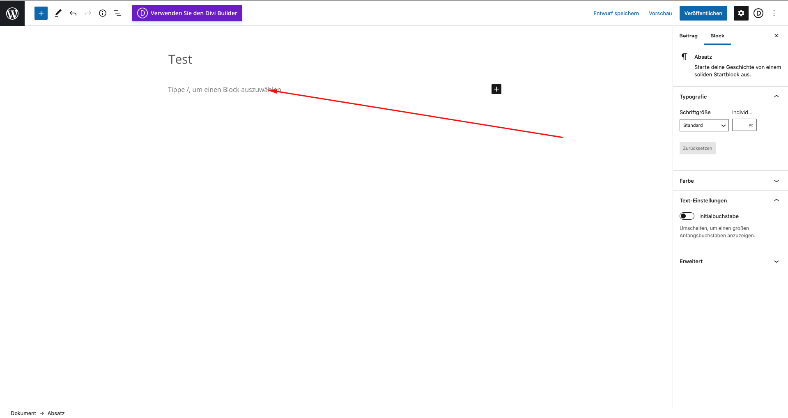

# Beiträge erstellen / bearbeiten

1. Ins Dashboard einloggen
2. Auf Beiträge klicken
3. Um einen neuen Beitrag zu erstellen auf "Erstellen" klicken 
4. Danach ist es empfehlenswert einen Titel einzugeben, und den Standart-Editor zu verwenden. 
5. Danach kann hier der Text eingegeben werden. 
6. Um das ganze zu Veröffentlichen einfach auf Veröffentlichen und nochmals auf den unteren Veröffentlichen Button klicken
7. Fertig :\)

