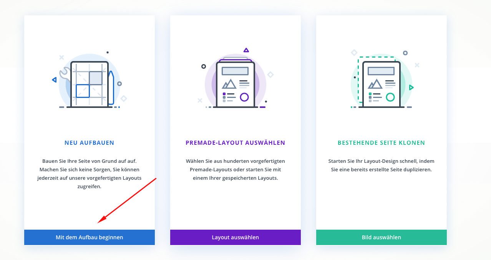
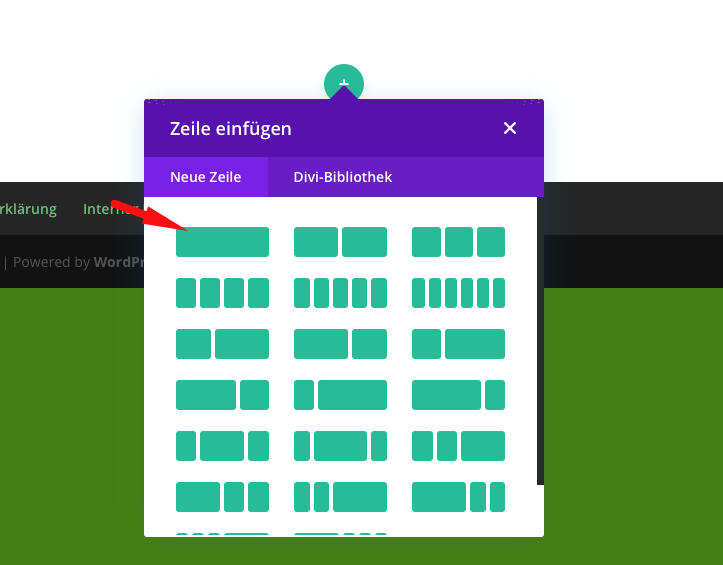
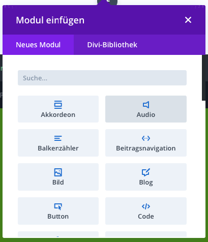
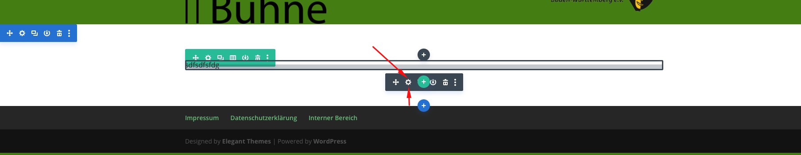
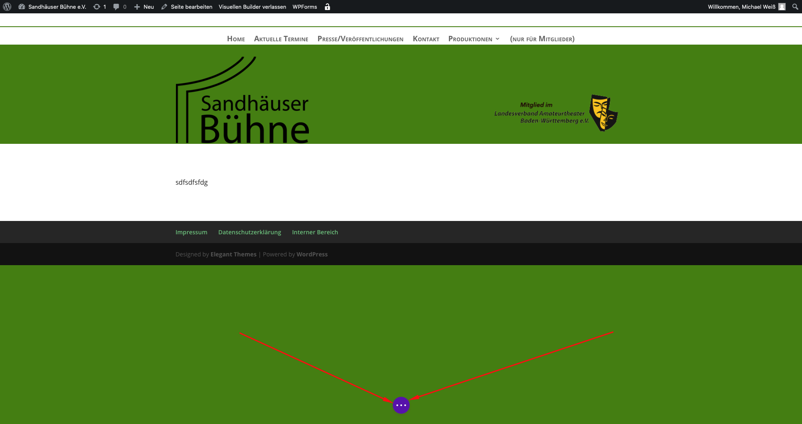
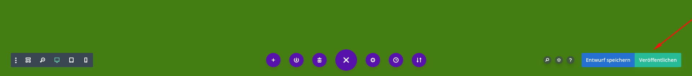

# Seiten erstellen / bearbeiten

1. Ins Dashboard einloggen
2. Auf Seiten klicken 
3. Auf Erstellen klicken 
4. Danach zuerst den Titel eingeben, danach auf Verwenden Sie den DIVI-Builder klicken 
5. Nochmals auf Verwenden Sie den Divi Builder klicken
6. Auf Mit dem Aufbau beginnen klicken 
7. Auf den ersten Block klicken 
8. Den gewünschten Block auswählen 
9. Bspw. Text, Bild, Code, Kontaktformular etc.
10. Um einen Block zu bearbeiten, die Maus darüber legen und auf das schwarze Zahnrad klicken 
11. Um eine Bearbeitung zu veröffentlichen einfach auf die drei Punkte unten klicken 
12. Und auf Veröffentlichen klicken 
13. Fertig!

